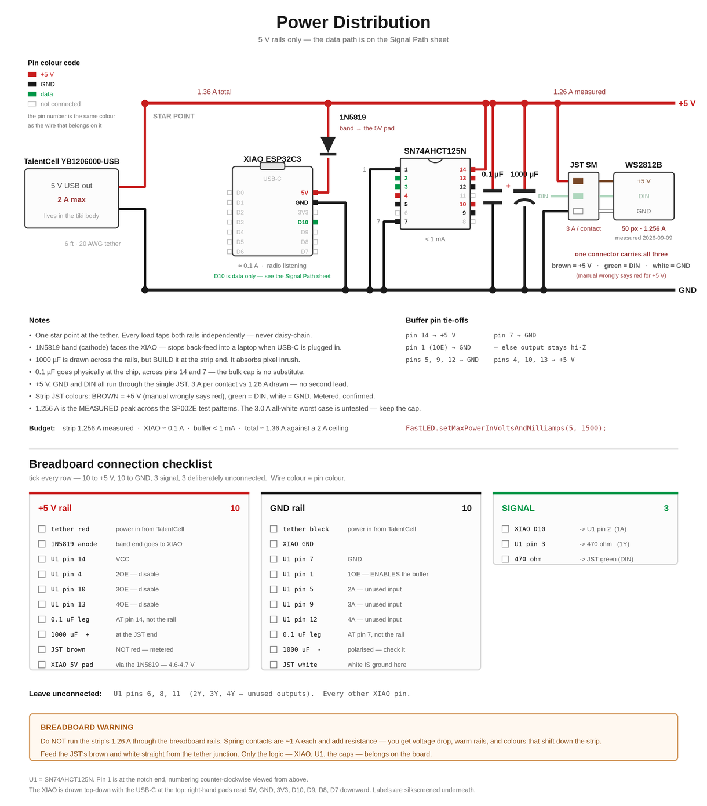
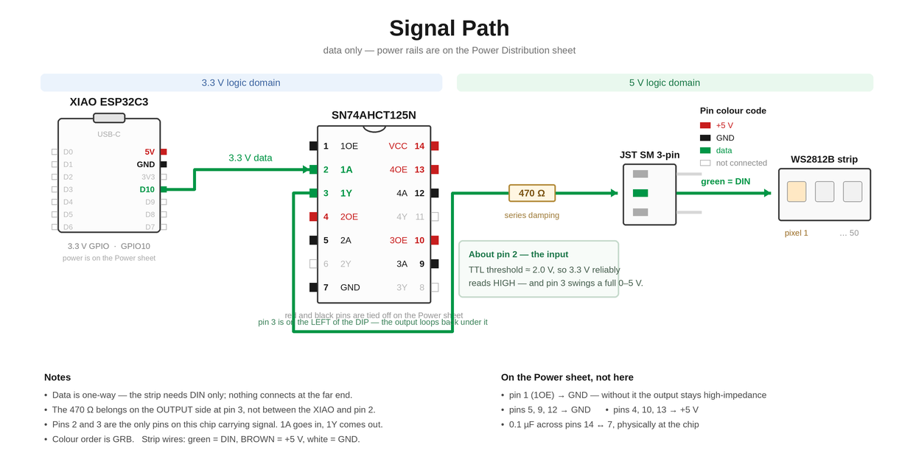

# Standalone Battery Build — revised plan
### Supersedes the LED-drive and power sections of `docs/archive/salvaged-fog-panel.md`

Date: 2026-09-04
Requirements: **battery powered, no extension cord, ~5–6 h per night, dimmable,
commanded by SFX_box over 433 MHz.**

---

## First, the honest answer about the salvaged panel

**The power draw isn't unusual.** That panel is roughly a 3–9 W fixture depending on how hard
you push it, which is completely normal for a small RGB effect light. A 5 m WS2812 strip at
full white is 60 W+. Nothing about this board is a power hog.

**The problem is its voltage, not its wattage.** The three-dies-in-series wiring puts the
blue and green strings at about 9.6 V. That is a genuinely awkward number for a battery:

- A 3S Li-ion pack is 12.6 V full but sags to ~9 V empty — the blue string goes dark
  before the pack is even flat.
- A USB power bank gives 5 V, so you'd need a boost converter just to reach the strings.
- Either way you're adding a converter stage, and then burning a chunk of what it produces
  in ballast resistors because red needs 6.6 V while blue needs 9.6 V off the same rail.

So: the panel is fine on a wall wart, and awkward on a battery. Since you've said not to feel
constrained by it — **don't be. There's a much easier path.**

---

## The easy path: addressable 5 V LED strip

Cut a length of **WS2812B or SK6812** strip. This collapses the entire electrical design:

| The old plan needed | With a strip |
|---|---|
| Boost converter to 10–12 V | **Nothing** — the strip runs on the same 5 V as the ESP32 |
| 3 MOSFETs or constant-current sinks | **Nothing** — the driver is inside each LED |
| 3 ballast resistors, sized by measurement | **Nothing** |
| Bench measurement of Vf before you can start | **Nothing** — it's a known, documented part |
| 3 PWM channels from the ESP32 | **One data pin** |

You also get a large capability upgrade for free. The salvaged panel can only ever be *one
color at a time*. A strip gives you per-pixel control: chases, sparkle, fire flicker, color
wipes, a pulse that travels around the frame. For a Halloween prop that difference is the
whole point.

### Parts

| Qty | Part | Notes |
|---|---|---|
| 1 | **SK6812 RGBW** or **WS2812B** strip, 60 LED/m, IP65 | ~0.5 m ≈ 30 LEDs suits a box. SK6812 RGBW gives a real white instead of a muddy RGB white, and is more forgiving about 3.3 V data (see gotchas). Cut only at the marked cut points. |
| 1 | **Seeed XIAO ESP32C3 — already on hand** | Tiny, USB-C, 11 GPIO, and it has LiPo charging built in. See the XIAO section below for pin mapping and the strapping-pin trap. |
| 1 | **RX480E-4 receiver — already on hand** | Paired with the TX118SA-4 in SFX_box. 3.3 V native, so it wires straight to the ESP32 with no level shifting. See the RF section below. |
| 1 | **USB power bank, 10,000–20,000 mAh** | See runtime table. Get one with a low-current / "trickle" mode. |
| 1 | USB-A to bare-wire or a USB breakout | To bring 5 V into the box |
| 1 | 74AHCT125 level shifter | Cheap insurance on the data line |
| 1 | 330–470 Ω resistor | In series with the data line |
| 1 | 1000 µF, 10 V electrolytic | Across the strip's 5 V and GND at its input |
| 1 | Enclosure + frosted acrylic or white PETG diffuser | Bend the strip into the frame shape if you liked the original panel's look |

---

## Runtime — this is the part that actually matters

A WS2812B draws about **60 mA at full white** (20 mA per die, three dies). At 30 LEDs:

| Scene | Draw | Power |
|---|---|---|
| All 30 at 100 % white | 1.8 A | **9 W** |
| Colored effects at 50 % brightness | ~0.45 A | **2.2 W** |
| Dim ambient glow | ~0.15 A | **0.8 W** |

Usable energy from a power bank runs about 70–80 % of its printed rating (the rating is at
3.7 V cell voltage; you lose the rest to the 5 V boost):

| Bank | Usable | @ 9 W (full white) | @ 2.2 W (typical) |
|---|---|---|---|
| 10,000 mAh | ~28 Wh | ~3 h | **~12 h** |
| 20,000 mAh | ~56 Wh | ~6 h | **~25 h** |

**A 10,000 mAh bank covers your 5–6 hour night with large margin** for anything short of
constant full white. A 20,000 mAh bank covers even the worst case. Both are cheap, already
have charging and protection circuitry built in, and can be swapped mid-show.

**Brightness is your runtime dial, and it's one line of firmware** (`FastLED.setBrightness()`).
Halve the brightness, double the runtime — and at night, 50 % looks about the same as 100 %
anyway. This is why "make it dimmable" was the right call: you can tune runtime after the fact
without touching a single component.

---

## Gotchas worth knowing before you order

**1. 3.3 V data into a 5 V strip is the classic flaky failure.** The WS2812B wants its data
high above 0.7 × VDD = 3.5 V; the ESP32 puts out 3.3 V. It usually works and then
intermittently doesn't — first pixel wrong color, random flicker, worse when cold or with long
leads. Three fixes, in order of goodness:
   - **74AHCT125 level shifter** ($1, bulletproof, just do this)
   - Put a **1N4001 in series with the strip's 5 V** to drop it to ~4.4 V, which raises your
     logic margin
   - Use **SK6812**, which is more tolerant in practice

**2. Power banks shut themselves off at low current.** Most cut out below ~50–100 mA, so an
idling prop kills its own power. Options: buy a bank that advertises a **low-current or
"trickle charge" mode** (marketed for earbuds and wearables), or keep a firmware idle floor —
a handful of pixels at low level draws enough to hold the bank awake. Don't use a bleeder
resistor; it wastes runtime for nothing.

**3. Standard strip hygiene.** 330–470 Ω in series with the data line at the ESP32 end, a
1000 µF cap across the strip's power at its input, and **never plug or unplug the strip with
power applied** — that's what kills the first pixel.

**4. Voltage drop** matters past about a meter of 5 V strip. At 30 LEDs in a box it doesn't.

---

## What happens to the salvaged panel

Keep it. It's a perfectly good fixture on a 12 V wall wart, and if you ever build a
mains-powered piece it drops straight into the driver design in `docs/archive/salvaged-fog-panel.md`
Section 3b. It's just the wrong part for a battery-powered box.

The `CLK-RF433A` receiver and the 433 MHz link design from the original doc carry over
unchanged — none of that depended on which LEDs you use.

---

## Revised architecture

```
 USB power bank (5 V) ──┬── XIAO ESP32C3 (own USB-C, or 5V pin via Schottky)
                        │      └── 3V3 out ── RX480E-4 (+V)
                        │                       D0..D3, VT ──> 5 ESP32 GPIOs (3.3 V, direct)
                        └── LED strip 5 V ──[1000 µF]
                                       │
      XIAO D10 ──[470 Ω]──[74AHCT125]── strip DATA IN
```

Four components, one voltage, no measurement required before you start.

---

## The controller: Seeed XIAO ESP32C3 (on hand)

Good board for this — small enough to disappear into the box, USB-C, 11 GPIO, and an
**onboard LiPo charger** with BAT+ / BAT− pads on the underside. Two things to get right.

### ⚠ Trap 1: three pins will stop the board booting

ESP32-C3 strapping pins are **GPIO2, GPIO8, GPIO9** — on this board's silkscreen, **D0, D8 and
D9**. They're sampled at reset and need to be high. The RX480E-4's outputs **idle LOW**, so
wiring any of D0/D1/D2/D3/VT to one of those three pins gives you a board that won't boot, or
boots into download mode, and looks like a dead XIAO.

**Use this mapping instead** (it also keeps the UART free for serial debugging):

| Function | XIAO silkscreen | GPIO |
|---|---|---|
| LED strip DATA | **D10** | GPIO10 |
| RX480E **D0** | **D1** | GPIO3 |
| RX480E **D1** | **D2** | GPIO4 |
| RX480E **D2** | **D3** | GPIO5 |
| RX480E **D3** | **D4** | GPIO6 |
| RX480E **VT** | **D5** | GPIO7 |
| *(free — serial debug)* | D6 / D7 | GPIO21 / GPIO20 |
| **DO NOT USE** | D0, D8, D9 | GPIO2, 8, 9 — strapping |

**Note the name collision.** The XIAO's silkscreen pins are called D0–D10 and the RX480E's
*outputs* are also called D0–D3. They are not the same thing and they do not line up. Keep this
table taped to the bench.

Power the RX480E from the XIAO's **3V3** pin — that rail is good for 700 mA and the receiver
draws a few mA.

### ⚠ Trap 2: don't run the strip's current through the XIAO

At full brightness the strip pulls 1.5–2.4 A. The XIAO's USB connector and its 5 V trace are
not built for that. **Split the 5 V at the power bank end**, not on the board:

```
 power bank ──┬── USB-C ─────────────> XIAO (its own connection)
              └── 5 V + GND ─[1000 µF]─> LED strip
                                  (common ground tied to XIAO GND)
```

If you'd rather feed the XIAO through its **5V pin** instead of the USB-C jack, Seeed requires a
**series Schottky diode** (anode to your supply, cathode to the pin). Don't skip it.

**Ground must be common** between the XIAO, the strip and the RX480E, or the strip data line has
no reference and you get garbage.

### About those BAT pads

Tempting — a LiPo straight on the board, charged over USB-C, no power bank. But the strip needs
5 V and a single cell gives 3.0–4.2 V, so you'd add a 3.7→5 V boost module rated for 2–3 A, and
at full brightness that pulls ~3 A from the cell. The onboard charger is also modest, so a large
cell takes a long time to fill. **Stick with the power bank** unless you decide the box only
ever runs as a dim accent glow, in which case a single cell plus a small boost is genuinely tidy.

Note also that Seeed's docs say battery voltage monitoring isn't available on this board, so you
can't show state of charge without extra hardware.

### Firmware notes

- **Use a recent FastLED (3.6 or newer)** — earlier versions predate ESP32-C3 support.
  `Adafruit_NeoPixel` and `NeoPixelBus` are solid fallbacks if FastLED gives you trouble on C3.
- The C3 drives WS2812/SK6812 timing from the **RMT peripheral**, so it's hardware-timed and
  won't glitch when the radio stack runs. Single core is not a problem here.
- The u.FL connector and included antenna are for **2.4 GHz WiFi/BLE** — nothing to do with the
  433 MHz link. The RX480E gets its own 17.3 cm wire.
- WiFi and BLE are available if you ever outgrow the four RF channels — **ESP-NOW** would give
  you full data payloads with no extra hardware.

---

## RF link — REVISED for the RX480E-4 / TX118SA-4 pair on hand

> **⚠ Superseded 2026-09-04 — see `docs/04-rf-link.md`.** The link moved to ESP-NOW. Short version:
> the Pi 4 can't transmit ESP-NOW on its own radio (no monitor mode / injection), so SFX_box gets a
> second XIAO ESP32C3 on USB acting as a serial-to-ESP-NOW bridge. The RX480E analysis below stays
> valid if you keep it as a backup "panic off" channel.

You already own a matched **TX118SA-4 transmitter / RX480E-4 receiver** pair (blue receiver
board, 6.7458 MHz superhet crystal, learn button, 7-pin header), and the transmitter is already
in SFX_box. **Use it.** It's a better starting point than the RXB6 plan, for one reason:

> These are not raw radios — they are an **encoder/decoder pair**. The EV1527 protocol, the
> pairing, the code learning and the noise rejection are all done in hardware. You get clean
> logic-level outputs and write no protocol code at all.

### What this changes

| | Old plan (RXB6, raw OOK) | RX480E-4 |
|---|---|---|
| What arrives | A raw bitstream you decode yourself | **4 CMOS logic lines** (D0–D3) + VT |
| Protocol work | RadioHead, packet format, checksums, repeats | **None** |
| Supply | 5 V, needs a divider into the ESP32 | **3.3 V native — wire straight to GPIOs** |
| Payload | Arbitrary — RGB values, fade times, box IDs | **Discrete triggers only** |

The trade is real: you can send *which* scene to run, but not *arbitrary data* like an exact
RGB value or a fade duration. For a prop that plays cued scenes, that's the right trade.

### Pinout and wiring (RX480E-4)

`GND · +V (3.3–5 V) · D0 · D1 · D2 · D3 · VT` — antenna solders to the pad/hole on the board;
use **17.3 cm** of straight wire (quarter wave at 433.92 MHz).

Power it from the ESP32's **3V3** pin and take D0–D3 plus VT straight into five GPIOs. No level
shifter, no divider — that's five fewer parts than the RXB6 plan.

**VT is worth wiring up.** It pulses on any valid decode, regardless of channel. Use it as a
link-alive heartbeat and a debug LED — it tells you instantly whether a dropout is an RF problem
or a firmware problem.

### Set it to MOMENTARY mode (one press of the learn button)

Not toggle, not interlock. Let the **firmware own all the state** so you can do fades, timeouts,
and a sensible failsafe. The module's latching modes will fight you the moment you want a scene
to fade out on its own.

Learning: press the learn button once (momentary mode), wait for the LED to go out, press the
remote/transmitter channel. LED flashes, then comes back on after ~3 s. Eight presses of the
learn button erases everything.

### Getting more than four commands

Four channels goes further than it looks:

1. **Combinations.** EV1527 sends a 4-bit data field, so driving two TX118SA-4 inputs at the
   same time should assert two D outputs together — 15 usable combinations instead of 4.
   **Test this before designing around it**; behavior varies between transmitter board revisions.
2. **Pulse counting.** Use D3 as a "select" line: N quick pulses on it = scene N, confirmed by
   a pulse on D0. Crude, fully deterministic, and needs no combination trickery.
3. **Chords over time.** D0 = next scene, D1 = previous, D2 = brightness step, D3 = off. Turns
   four lines into a small remote-control vocabulary.

### The real limitation to plan around

**There's no addressing beyond the learned pairing.** If you build a second LED box and it
learns the same transmitter, both boxes respond to the same four channels identically. So the
four channels are a budget shared across every box in the installation — four boxes with one
cue each, or one box with four scenes, not both.

If the installation grows past that, *then* add a generic TX/RX pair (or ESP-NOW, which the
ESP32 already has) alongside this one for full data. Don't buy it now.


---

## Level shifter wiring — SN74AHCT125N

**What it does:** it's a quad non-inverting buffer, powered from 5 V, whose inputs use **TTL
thresholds** (logic HIGH above ~2.0 V) rather than CMOS ones. So a 3.3 V signal from the XIAO
reliably reads as HIGH, and the output swings a clean 0–5 V into the strip. That's the whole
trick — it re-levels 3.3 V logic to 5 V logic, and drives the strip's capacitive input hard
enough to keep the edges sharp.

**Why it's needed:** the WS2812B datasheet wants data HIGH above **0.7 × VDD = 3.5 V**. The
ESP32-C3 puts out 3.3 V. That's below spec, so it works most of the time and then intermittently
doesn't — first pixel wrong color, random flicker, worse when cold or with longer leads.

**⚠ The "T" is not optional.** `74AHCT125` has TTL input thresholds; `74AHC125` (no T) has CMOS
thresholds at 0.7 × VCC and will **not** solve the problem. Same for `74HCT125` (fine) vs
`74HC125` (no good). If you ever substitute, the part number must contain **HCT**.

### Pinout (DIP-14, notch at top)

```
          ┌──∪──┐
   1OE ─ 1│     │14 ─ VCC   → 5 V
    1A ─ 2│     │13 ─ 4OE
    1Y ─ 3│     │12 ─ 4A
   2OE ─ 4│     │11 ─ 4Y
    2A ─ 5│     │10 ─ 3OE
    2Y ─ 6│     │ 9 ─ 3A
   GND ─ 7│     │ 8 ─ 3Y
          └─────┘
```

Four independent buffers. Each has an active-LOW output enable (`OE`). You only need one.

### Connections

| Pin | To |
|---|---|
| 14 (VCC) | **5 V** — the same rail as the strip |
| 7 (GND) | common ground (XIAO, strip, battery all tied) |
| 1 (1OE) | **GND** — enables buffer 1 |
| 2 (1A) | **XIAO D10 (GPIO10)** — data in |
| 3 (1Y) | **470 Ω → strip DIN** — data out |
| 4, 10, 13 (2OE/3OE/4OE) | VCC — disables the unused buffers |
| 5, 9, 12 (2A/3A/4A) | GND — never float CMOS inputs |

Add a **0.1 µF ceramic between pins 14 and 7**, physically at the chip.

**The 470 Ω goes on the output side**, between pin 3 and the strip's data input — it damps
reflections on the line into the strip. Not between the XIAO and the buffer.

**Power the buffer from the same 5 V as the strip.** If the strip sees 5.0 V and the buffer runs
from something lower, you're back to a marginal threshold and you've bought nothing.

---

## Power distribution — TalentCell to strip + XIAO

One USB-A output feeds everything. It splits at a **single star point** on the bar.

```
  TalentCell YB1206000-USB
   └─ USB-A out, 5 V, 2 A max
        │
        │  USB-A male → bare-wire pigtail
        │  spliced to 6 ft of 20 AWG 2-conductor tether
        ▼        ( up into the mouth )
   ══════════ STAR POINT at the bar ══════════

   +5 V ●──┬─────────────┬──────────────┬──────────────┐
           │             │              │              │
        1000 µF      strip 5 V     74AHCT125       1N5819 ─▶|
         16 V                        pin 14         (Schottky)
           │             │              │              │
   GND  ●──┴─────────────┴──────────────┴──────────────┴──▶ XIAO 5V pin
                    (all grounds common — XIAO GND too)

   XIAO D10 ──▶ 74AHCT125 pin 2
   74AHCT125 pin 3 ──[470 Ω]──▶ strip DIN
```

### Why the Schottky

Seeed requires a **series diode into the XIAO's 5V pin**, anode to your supply, cathode to the
pin. It stops the TalentCell from back-feeding a laptop's USB port on the days you have USB-C
plugged in for programming while the battery is also on. Either a **1N5817** (0.32 V drop) or
a **1N5819** (0.45 V) does the job — 1 A parts, through-hole, pennies.

**The board has a 1N5819** (confirmed 2026-09-10). Every figure in this repo already assumes
it: the XIAO's 5 V pad reads **4.6–4.7 V**, not 5.0, and that reading is how you confirm the
diode is the right way round rather than a fault. `docs/03` used to say 1N5817 in four places
while the diagrams said 1N5819 — the diagrams were right, and the two now agree.

After the diode the XIAO's 5V pin sees ~4.7 V, its onboard LDO makes 3.3 V from that with room to
spare. The buffer and the strip stay on the full 5 V.

*Alternative that skips the diode:* power the XIAO through its USB-C port instead — but the
TalentCell has only one USB output, so you'd need a splitter. The diode is cleaner.

### Placement

- **1000 µF right at the strip's input**, not back at the battery. Its job is to absorb the inrush
  when 144 pixels jump brightness at once; it can only do that if it's next to them. The step it
  has to absorb is now about three times what it was sized against — it is still the right part,
  but if the strip flickers on a breath peak with `pwr` reporting headroom, this is the suspect
  before the firmware is.
- **0.1 µF ceramic across pins 14 and 7 of the buffer**, physically at the chip.
- **One star point.** Don't daisy-chain XIAO → buffer → strip; run each leg back to the same
  junction so strip current never flows through a logic ground path.

### Current budget

**The pixel count went from 50 to 144 on 2026-09-12** — the whole ~1 m (3.2 ft) strip is lit
rather than a 14" section of it. Nothing about the renderer changed; the draw tripled. This
section was rewritten for that, and **the 1.256 A measurement no longer describes this build**:
it was 50 pixels driven by the SP002E, and it is kept below only as the record of what the power
path was proven to carry.

| | Draw | |
|---|---|---|
| Strip, 144 LEDs — fire at `brightness 110`, the approved look | **~1.5 A** | **estimated**, from the manual's 0.12 W/LED and a 110/255 scale |
| Strip, 144 LEDs — fire at full brightness | ~3.5 A | past the ceiling; the FastLED cap is what stops it |
| Strip, 144 LEDs — all white, full brightness | ~8.6 A | not reachable on this supply at all, by a factor of four |
| XIAO ESP32C3, radio listening | ~0.1 A | estimate |
| 74AHCT125 | negligible | |
| **Total at the approved look** | **~1.6 A** | |
| TalentCell USB ceiling | **2.0 A** | **~20 % headroom** — was 32 % at 50 pixels |

**⚠ Every strip number in that table is arithmetic, not a measurement.** The firmware answers the
same question about the frame that is actually on the strip:

    ./send.sh bar pwr
    pwr leds=144 br=110 allowed=110 wantMA=1487 capMA=1500 estMA=1487 headroom (+~45mA XIAO, not counted)

`wantMA` is what the frame would draw at `brightness`; `estMA` is what the cap will allow it.
`LIMITING` instead of `headroom` means the cap — not `brightness` — is setting the level of what
you are looking at. `st` carries `mA=` too, with a `!` for the limiting case, because reading it
over serial reboots the board and answers about the compiled defaults. **A meter on the supply
should read somewhat above `estMA`** — it includes the XIAO, and FastLED's model counts LEDs only
at an assumed 5.0 V. A meter reading far above it means the model is wrong, and the meter wins.

**The cap is no longer a distant guard rail, and that is a change to the EFFECT.** At 50 pixels
the frame never approached 1500 mA, so the limiter was inert and `brightness` alone set the level.
At 144 the approved look sits within a few percent of the cap, so the bright frames — a breath
peak, a word flash — are the ones that get held down. That is a dim that moves *against* the
effect, and it will read as the fire fighting itself rather than as a power problem. If that shows
up, **lower `brightness` until `pwr` reports headroom**; do not raise `maxMA` past what the supply
can deliver, because a brownout part-way along a WS2812B run reads as random colour, not as
dimming.

**Runtime, roughly halved.** ~1.5 A × 5 V = 7.5 W for the strip, ~8 W with the XIAO. The
TalentCell's 5 V rail is rated 12000 mAh (~60 Wh), call it ~52 Wh usable:

| | Draw | Runtime |
|---|---|---|
| 144 px, fire at `brightness 110` | ~8 W | **~6.5 h** |
| 144 px, fire at `brightness 70` | ~5.5 W | **~9 h** |
| *(50 px, fire at `brightness 110` — what this was)* | ~3 W | *~17 h* |

A 5–6 hour night is still covered, but **the margin is now one night rather than two.** Charge
between nights instead of assuming it holds.

**Set the FastLED cap to 1500 mA, not 1700** — the cap governs only the LEDs, so leaving 500 mA
covers the XIAO plus converter tolerance:

```cpp
FastLED.setMaxPowerInVoltsAndMilliamps(5, 1500);
```

It is also live as `set maxMA <mA>`, which exists because with a meter in hand the cap is a number
you set by measurement rather than by recompiling. It persists on `save` like every other
parameter.

**If the whole strip wants to be brighter than this allows**, the answer is not a bigger cap: it
is the TalentCell's **12 V output, rated 3 A**, through a 5 V/3 A buck module. That retires the
2 A ceiling and takes the all-white case with it. See `05-parts.md`.

### Wire gauge check

6 ft of 20 AWG, out and back, is about 0.12 Ω. At 1.5 A — the 144-pixel figure — that's a
**0.18 V drop**, so the strip sees ~4.8 V, which is fine. 22 AWG would drop ~0.29 V and still
work, but at this current 20 AWG stops being merely the comfortable call: **don't go thinner than
20 now.** Volt drop is also fed by the strip's own copper, and over a full metre the far end is
dimmer and warmer-toned than the near end by more than it was over 14". If a colour gradient
along the run shows up, that is the cause, and the fix is injecting +5 V and GND at the far end
as well — not a firmware change.

### One development caution

If you have USB-C plugged into the XIAO with the TalentCell switched **off**, the strip is
unpowered while the data line is live — that trickles current into the strip through its
protection diodes. Harmless briefly, but don't leave it sitting that way. Switch the TalentCell on
whenever the XIAO is running.

---

## Confirmed strip specs (from the manual that shipped with it)

| Spec | Value | Why it matters |
|---|---|---|
| IC | WS2812B | As expected |
| **Colour order** | **G R B — not RGB** | FastLED: `WS2812B, PIN, GRB`. This is FastLED's default for WS2812B, so nothing to change — but now it's confirmed rather than assumed. |
| Grayscale | 256 / channel | 8-bit per channel; gamma correction matters more, not less |
| View angle | 120° | See the density note below |
| Power | **0.1 W/LED one colour · 0.2 W two · 0.3 W all three** | The source of every number in the budget above. At **144 LEDs**: full white = 43 W = **8.6 A**, unreachable; fire at ~0.12 W/LED = 17 W = **3.5 A** at full brightness, **~1.5 A** at `brightness 110`. |
| **Operating temp** | **−20 to +40 °C** | ⚠ New constraint — see below |
| Supply | DC 5 V. *"Higher than 5V will destroy it."* | No creative 12 V shortcuts |
| Construction | FPCB in 50 cm sections, **solder joint every 50 cm** | ⚠ **The 14" cut avoided the joint; the full metre does not.** There is a factory solder joint mid-run, around **pixel 72**, and it now carries the current for everything past it. If the far half of the strip drops out, dims, shifts colour, or flickers while the near half is clean, suspect that joint before the firmware — it is the one mechanical discontinuity in the run. |
| Wire colours | manual says **red = +5 V · white = GND · green = DIN** | ⚠ On the strip that shipped, +5 V is **BROWN**, not red. White is GROUND, not signal. Ring the wires out to the pads before connecting anything. |

### ⚠ +40 °C is a real ceiling

A sealed tiki mouth sitting in Florida sun can pass 40 °C ambient with no power applied at all,
and at 144 pixels you're adding ~7.5 W inside it rather than the ~3 W this was written against. Two consequences:

- **Don't leave the bar powered during the day.** It's a night prop; power it when the show runs.
  With 144 pixels lit the heat inside the channel is roughly three times what this warning was
  written against — the aluminium has the length to shed it, but the sealed-mouth case did not
  get easier.
- **Keep the tiki out of direct afternoon sun** if the bar lives in it permanently, or pull the
  bar between nights — which the ~6.5 h runtime at 144 pixels is now another reason to do anyway.

The aluminium channel is doing real work here, not just optics.

### The density argument, corrected

I justified 144/m partly on the grounds that 60/m would show hot spots at a 5" throw. With the
manual's **120° view angle**, that was wrong: at 127 mm each LED's cone is ~440 mm wide, so even
at 60/m spacing about 26 LEDs overlap at any point on the surface. Blending was never going to be
the problem.

**144/m is still the right choice, for the other reason: effect resolution.** ~50 independently
addressable points across the bar versus ~21 is what lets the wandering bright zone actually
wander instead of stepping. That argument holds — and at the full metre it is 144 points rather
than 50, which is resolution the effect gets for free because `spaceScale` and `flareWidth` are
both per-pixel: the fire keeps its grain and gets more of it. The one parameter the longer run
genuinely invalidates is `flareMeanS`, whose rate is per *strip*: 3.5 s judged across 14" is a
third of the crackle density across 39". `set flareMeanS 1.2` restores it, by eye, on the prop.

---

## The SP002E mini controller — ✅ smoke test PASSED

The strip shipped with an **SP002E** inline controller. It isn't part of the final build, but it
is the best debugging tool in the box:

- DC5V, SPI out, drives up to 600 pixels, 68 built-in patterns, button-controlled
- Wiring: **red = VCC, white = GND, green = DIN**
- MODE+ / SPEED / MODE− buttons; MODE+ and MODE− together enters AUTO

> **✅ Done, 2026-09-09.** All 50 pixels light and the power path is proven at real current.
> This section is kept as the record of what was tested and as the procedure to repeat if the
> strip is ever suspected again.
>
> **What it no longer covers:** that test was the 50-pixel run. The build now lights all 144, so
> neither the far half of the strip nor its mid-run solder joint has been through this. The SP002E
> drives up to 600 pixels, so **repeating this on the full strip is still the cheapest way to
> separate a bad strip from bad code** — and it is the only way to do it with no firmware involved.

**Before writing a single line of firmware**, power the strip through the SP002E and confirm every
pixel lights — 50 then, 144 now. That cleanly separates "bad strip, bad solder joint, or bad power" from "bad
code" — which is the single most common way an LED build eats an evening.

Its colours may look swapped (it declares RGB order, the strip is GRB). Irrelevant for a smoke
test — you're checking that every pixel lights, not what colour it is.

---

## Connectors — already covered

The strip came with **JST SM 3-pin connectors** fitted plus spare pigtails. Nothing to buy. Use
that connector as the service disconnect between the bar and the electronics pod so the bar can
come out of the mouth without desoldering anything.

---

## Power distribution diagram



*`../images/power-distribution.png` — redrawn to match the Signal Path sheet. Power rails only;
the data path is on its own sheet below. Steve's original hand-drawn version is kept at
`../images/power-distribution-hand-drawn.png` — it was reviewed 2026-09-09 and found correct, including the
1N5819 orientation.*

Everything on this sheet hangs off **two horizontal rails** — +5 V in red, GND in black — with a
single **star point** where the tether lands. Each load taps both rails independently; nothing is
daisy-chained. Current annotations show what each segment of the +5 V rail actually carries.

### Verified correct

*This table is the review of Steve's original hand-drawn sheet
(`../images/power-distribution-hand-drawn.png`), done 2026-09-09. It is kept because the
1N5819 verdict is the one worth having on record.*

| Node | Check |
|---|---|
| USB-A pigtail red → **+5 V rail** (red) | ✓ |
| USB-A pigtail black → **GND rail** (black) | ✓ |
| 1000 µF across the two rails, correct polarity | ✓ |
| **1N5819 band (cathode) toward the XIAO's 5V pin**, anode to the +5 V rail | ✓ — this is the one that matters, and it's right. Current flows rail → anode → cathode → XIAO. |
| XIAO **GND** → GND rail | ✓ |
| SN74AHCT125N **pin 14 (Vcc)** → +5 V rail | ✓ |
| SN74AHCT125N **pin 7 (GND)** → GND rail | ✓ |
| LED strip **+5 V** → +5 V rail, **white** → GND rail | ✓ — white is ground on this strip, which is correct. The hand-drawn sheet labelled the strip's +5 V lead red; on the strip that shipped it is **brown**. Metered 2026-09-09. |

The topology is right: one +5 V rail, one GND rail, every load tapping both independently. No
daisy-chaining.

### What the hand-drawn sheet was missing — all now on the redrawn sheet

None of these were errors in a power-only sketch; they are the pieces that have to exist on the
board, and every one of them is drawn or tabulated on `../images/power-distribution.png` today.
Listed here because they are still the four things to check on a built board:

1. **0.1 µF ceramic across pins 14 and 7**, physically at the chip. The bulk cap does not
   substitute for it.
2. **Pin 1 (1OE) → GND.** Without this the buffer's output stays high-impedance and the strip
   sees nothing. This is the single most likely "everything looks right but no lights" fault.
3. **Unused inputs tied off:** pins 5, 9, 12 (2A/3A/4A) → GND. Floating CMOS inputs oscillate and
   waste current. Pins 4, 10, 13 (2OE/3OE/4OE) → +5 V to keep those outputs disabled.
4. **The data path** — not shown on a power diagram, correctly, but for completeness:
   `XIAO D10 → pin 2 (1A)` … `pin 3 (1Y) → 470 Ω → strip green (DIN)`.

### One physical note the schematic can't show

Schematically the 1000 µF sits across the rails and its position is irrelevant. **Physically it
belongs at the strip end of the board**, next to the JST output — its job is absorbing inrush when
144 pixels jump brightness at once, and it can only do that from the strip side. Drawn near the USB
input, built near the LED output.

---

---

## Breadboard connection checklist

Reproduced from the bottom of `../images/power-distribution.png` so the counts exist in text as
well as in the image. **10 to +5 V, 10 to GND, 3 signal, 3 deliberately unconnected.** Tick every
row before power goes on.

`U1` = SN74AHCT125N. Pin 1 is at the notch end, numbering counter-clockwise viewed from above.

### +5 V rail — 10 connections

| # | Connection | Note |
|---|---|---|
| 1 | tether red | power in from the TalentCell |
| 2 | 1N5819 anode | the band (cathode) end goes to the XIAO |
| 3 | U1 pin 14 | VCC |
| 4 | U1 pin 4 | 2OE — disables the unused buffer |
| 5 | U1 pin 10 | 3OE — disables the unused buffer |
| 6 | U1 pin 13 | 4OE — disables the unused buffer |
| 7 | 0.1 µF leg | **at pin 14**, not out on the rail |
| 8 | 1000 µF + | at the JST end |
| 9 | JST **brown** | NOT red — metered and confirmed |
| 10 | XIAO **5V** pad | fed through the 1N5819, so it reads 4.6–4.7 V, not 5.0 V |

### GND rail — 10 connections

| # | Connection | Note |
|---|---|---|
| 1 | tether black | power in from the TalentCell |
| 2 | XIAO GND | |
| 3 | U1 pin 7 | GND |
| 4 | U1 pin 1 | 1OE — this one **enables** the buffer; without it the output stays hi-Z |
| 5 | U1 pin 5 | 2A — unused input, never float a CMOS input |
| 6 | U1 pin 9 | 3A — unused input |
| 7 | U1 pin 12 | 4A — unused input |
| 8 | 0.1 µF leg | **at pin 7**, not out on the rail |
| 9 | 1000 µF − | polarised — check it twice |
| 10 | JST **white** | white IS ground on this strip |

### Signal — 3 connections

| # | From | To |
|---|---|---|
| 1 | XIAO **D10** | U1 pin 2 (1A) |
| 2 | U1 pin 3 (1Y) | 470 Ω |
| 3 | 470 Ω | JST **green** (DIN) |

### Leave unconnected — 3

U1 pins **6, 8, 11** (2Y, 3Y, 4Y — unused outputs). Outputs may float; inputs may not.
Every other XIAO pad is unused.

### Pin colour code on the diagrams

Both sheets now colour every pin by what belongs on it, so a wired-up board can be checked by
eye — the colour of the wire in your hand should match the colour of the pin it lands on.

| Colour | Meaning | U1 pins | XIAO pads |
|---|---|---|---|
| **Red** (filled) | goes to **+5 V** | 4, 10, 13, 14 | 5V |
| **Black** (filled) | goes to **GND** | 1, 5, 7, 9, 12 | GND |
| **Green** (filled) | **data** | 2 (1A in), 3 (1Y out) | D10 |
| Hollow / grey | **not connected** | 6, 8, 11 | everything else |

Both the little rectangle representing the pin and the pin number itself carry the colour, so the
colour of the wire in your hand should match the colour of the pin it lands on.

The counts reconcile with the checklist. On +5 V: four red U1 pins and the XIAO's 5V pad make
five, and the other five rows are the tether, the diode anode, the two caps and the JST brown.
On GND: five black U1 pins and the XIAO's GND pad make six, and the other four are the tether,
the two caps and the JST white.

One thing the colour hides: the XIAO's 5V pad is red because it is a power pad, but it does not
tie to the rail directly — it sits behind the 1N5819, so it reads **4.6–4.7 V**. That is the
expected value, not a fault.

### The XIAO pad map, as drawn

Both diagrams now show the XIAO top-down with the USB-C at the top, the same way the
SN74AHCT125N is drawn. Read the right-hand column downward:

| Left, top → bottom | Right, top → bottom |
|---|---|
| D0 D1 D2 D3 D4 D5 D6 | **5V** **GND** 3V3 **D10** D9 D8 D7 |

The silkscreen labels are on the **underside** of the board, so with the module face-up on the
breadboard you are working from this map, not from the printing.

> **Breadboard warning.** Do not run the strip's 1.26 A through the breadboard power rails.
> Spring contacts are rated around 1 A each and add contact resistance — the result is voltage
> drop, warm rails, and colours that shift down the length of the strip. Feed the JST's brown
> and white straight from the tether junction. Only the logic — XIAO, U1, the two caps —
> belongs on the board.

## Signal path diagram



*`../images/signal-path.png` — companion to the power sheet. Data only; the two sheets together
cover the whole board.*

### The path, in words

```
XIAO D10 (GPIO10)  ──3.3 V──▶  AHCT125 pin 2 (1A)
AHCT125 pin 3 (1Y) ──5 V────▶  470 Ω  ──▶  JST green  ──▶  strip DIN (pixel 1)
```

The chip sits exactly on the domain boundary: 3.3 V logic on its input side, 5 V logic on its
output side. That crossing is the entire reason it exists — its TTL input threshold of about
2.0 V means 3.3 V reads as a solid HIGH, and its output swings the full 0–5 V the strip's
datasheet asks for.

### Three things this diagram is making explicit

**The 470 Ω is on the output side.** Pin 3 → resistor → strip. Not between the XIAO and pin 2.
Its job is damping reflections on the line running to the strip, so it has to be at the driving
end of *that* line.

**Data is one-way.** The strip needs DIN only. Nothing connects at the far end of the cut run —
there's no return, no termination, no DOUT to wire back.

**Only buffer 1 is used.** Pins 2 and 3 are the whole signal path; the other three buffers are
greyed out here and tied off on the power sheet.

### Both signal pins are on the LEFT side of the DIP

This is the one thing about the AHCT125 that trips people up when they go from the diagram to a
breadboard. In a DIP-14, pin 1 is at the notch and numbering runs counter-clockwise, so pins 1–7
are all down the left side and 14–8 come back up the right. Buffer 1's input (pin 2, 1A) and its
output (pin 3, 1Y) are therefore **adjacent, both on the left** — the signal goes in and comes
straight back out one pin below, on the same edge.

The diagram draws it that way: the output leg leaves pin 3 on the left, loops back under the
chip, and heads right to the 470 Ω. The loop is cosmetic — on the board it's just a short jumper
from pin 3.

*(An earlier revision of this sheet drew that wire leaving the right-hand edge, which put it at
pin 12 — a GND-tied unused input. Corrected 2026-09-09. If you built from a printout made before
that date, check this one wire.)*

Pin 11 (4Y) is an unused output and connects to nothing at all. It is hollow on the diagram and
appears in no checklist column. An earlier revision had a callout leader line ending near it,
which made it look annotated; that leader is gone, and the note it belonged to now says plainly
that it is about pin 2.

### Cross-sheet checklist

The two diagrams are complete only together. On the **power** sheet:

- pin 1 (1OE) → GND — *without this the output stays high-impedance and the strip sees nothing*
- pins 5, 9, 12 → GND · pins 4, 10, 13 → +5 V
- 0.1 µF across pins 14 ↔ 7, physically at the chip

---

## Can power go through the JST instead of the separate leads?

**Yes.** Run +5 V, GND and DIN all through the one 3-pin JST SM and cut the separate power
pigtail off. One connector to the bar.

### The numbers

**JST SM is rated 3 A per contact** (2.5 mm pitch, AWG 22–28). Against that:

| | Current | % of rating |
|---|---|---|
| Fire effect, 144 px at `brightness 110` | ~1.5 A | 50 % |
| FastLED cap (`maxMA`, live) | 1.5 A | 50 % |
| Fire at full brightness, uncapped | ~3.5 A | **117 % ⚠** |
| Full white, uncapped | ~8.6 A | **287 % ⚠⚠** |

*(At 50 pixels those last two rows were 1.2 A and 3.0 A, and the connector had margin on every
one of them. It does not any more.)*

At the current this prop actually draws you're at half the connector's rating. **The firmware cap
is what keeps you there, and at 144 pixels it is the only thing that does** — the uncapped cases
now exceed 3 A per contact rather than just touching it, so the cap is doing triple duty:
the TalentCell's 2 A ceiling, the connector's 3 A, and the strip's own copper. The supply gives
out first in practice, which is the merciful ordering; don't rely on it.

### So why does the strip ship with separate power leads?

Because it ships as a **5 m reel**, and a full reel at white draws 15–20 A. No JST survives that,
so the extra leads exist for **power injection** partway along a long run. You cut 14 inches off
the front. That reason doesn't apply to you.

This is the general shape of it: most LED strip wiring advice is written for people running metres
of strip, and a lot of it stops being true at 35 cm.

### It's also better than just tidier

- **One disconnect point** — the bar leaves the mouth in a single motion, no second connector to
  reach behind.
- **One thing to seal.** In a tiki mouth in Florida, every wire entry is a place water gets in.
  Halving them is worth more than the neatness.

### Two things to do

**Check the gauge.** These pigtails are usually 22 AWG, which is comfortable at 1.2 A over a few
inches. If yours measures thinner than that, it still works at this current, but don't extend it.

**Trim and individually heat-shrink the unused power leads** right back at the strip. Don't leave
bare copper in a mouth that gets damp — and don't heat-shrink the pair together, or you've made a
short waiting to happen.

*(Note: a lot of "JST SM" on inexpensive strips are clones rather than genuine JST. At 1.2 A that
makes no practical difference. It's a reason not to plan on running 3 A through one continuously.)*

**Unchanged by this:** the 1000 µF still belongs on the pod, right at the JST. It's still the
strip end of the board.

### Confirmed by the vendor's own controller

The **SP002E** that shipped with the strip powers it through the single 3-pin JST — its manual
says *"the external DC power supply supplies both the mini controller and the led strip."* One
supply, one connector, full strip current through those three contacts. That's the manufacturer's
intended wiring, not a workaround, and it's better evidence than the rating table.

The SP002E's 600-pixel figure is consistent with this once you notice it can't mean 600 pixels
through one JST — 600 at white would be 36 A. It means 600 *addressable*, with power injected
along the run. Same conclusion from the other direction: **single connector for short runs,
injection for long ones.**

**This is what made the smoke test worth doing, and it passed.** Running the cut strip on the SP002E with the
USB meter inline now validates the entire power path — real current, real connector — before the
perfboard exists. Run a bright pattern for ten minutes and feel the connector. Cool at 1.2 A and
the question is closed empirically.


---

## ⚠ Wire colours: the manual is wrong about this strip

The manual states the power wire is **red**. On the strip that actually arrived it is **brown**.

| Function | Manual says | This strip |
|---|---|---|
| +5 V | red | **brown** |
| DIN | green | green |
| GND | white | **white** (not black) |

### Two different colour conventions in one build

This is the part that bites. The wire colours change depending on whose wire you're looking at:

| | +5 V | GND | Data |
|---|---|---|---|
| **Your tether** (20 AWG you buy) | red | **black** | — |
| **The strip's JST** (vendor's loom) | **brown** | **white** | green |

So on the perfboard, a **red** wire and a **brown** wire land on the same +5 V bus, and a **black**
wire and a **white** wire land on the same GND bus. Both are correct. The diagrams draw the rails
red and black because that's the convention for *your* wiring, and show the JST contacts in their
actual brown / green / white.

**Never wire an LED strip by wire colour.** Cheap strips are assembled from whatever loom stock
was on the bench, and the printed manual is a generic one shared across a whole product family.

**The PCB silkscreen is the authority.** The strip's pads are marked `+5V`, `DIN` (sometimes `DI`)
and `GND`. Meter in continuity mode, one probe on each JST wire, the other on each pad in turn.
Write down what you find and tape it to the bar.

Two minutes of work against two expensive failure modes: **5 V onto the DIN pad kills the first
pixel instantly**, and a reversed supply takes the whole run.

> **✅ Done, 2026-09-09.** Metered and confirmed: +5 V is brown, DIN is green, GND is white,
> exactly as the diagrams show.

Do this **before** the SP002E smoke test, not after — the smoke test is only meaningful once you
know the wiring is right.

The diagrams and the perfboard wiring list now use **brown = +5 V** to match the physical part.

---

## Placed, not installed — the borrowed-prop constraint

**The tiki is borrowed and goes back.** The wireless gear comes out at the end of the season
and the eyes revert to a plain power supply. The light bar is *placed* in the mouth, never
installed.

That is a real constraint, not a footnote, and it changes three things.

### ⚠ Correction: the diffusing surface cannot be the tiki

Earlier in this doc I said the surface matters as much as the strip, and suggested textured
rock paint or burlap on the back of the mouth. **Scratch that** — you cannot paint, glue,
sand or line the inside of a prop you are giving back.

The fix is better than the original advice: **the backdrop travels with the bar.**

A curved card or fabric insert, matte and warm-toned, that sits in the mouth in front of the
tiki's own surface and takes the light. It costs almost nothing, it is trivially removable,
and — the real win — **it makes the effect reproducible in any prop.** The bar stops depending
on what it happens to be sitting inside. Next season's cauldron or fireplace gets the same
throw and the same colour response because it is lighting the same backdrop.

Make it part of the assembly, not part of the venue.

### Mounting becomes a sled

No screws, no adhesive, no clips into the tiki. The 45° channel needs a **self-supporting
foot** — a 3D-printed sled the channel clips into, shaped to sit stably against the back of
the teeth and weighted enough not to shift when the prop is bumped.

Design it to be lifted out in one motion with no tools. Anything requiring a screwdriver at
the tiki will not get removed carefully at 1 a.m. on 1 November.

### The tether crosses someone else's property

Six feet of cable from a battery in the tiki body to a bar in the mouth means threading wire
through an object you do not own. Two consequences:

- **Route it, don't wedge it.** Dress the cable so it exits cleanly and cannot be pinched by
  a jaw, a lid, or someone lifting the prop by the head.
- **Consider putting the battery outside the tiki entirely** — behind it or below it on the
  ground — rather than inside. The TalentCell does not care where it sits, and a battery
  outside the prop is one fewer thing to retrieve from inside a borrowed object.

### Leave-no-trace checklist

- [ ] Nothing adhesive touches the tiki
- [ ] Nothing is fastened to the tiki
- [ ] No paint, no abrasion, no marking
- [ ] Backdrop, sled, bar, tether and battery all lift out as separate pieces
- [ ] Photograph the mouth before installing, so "as found" is documented
