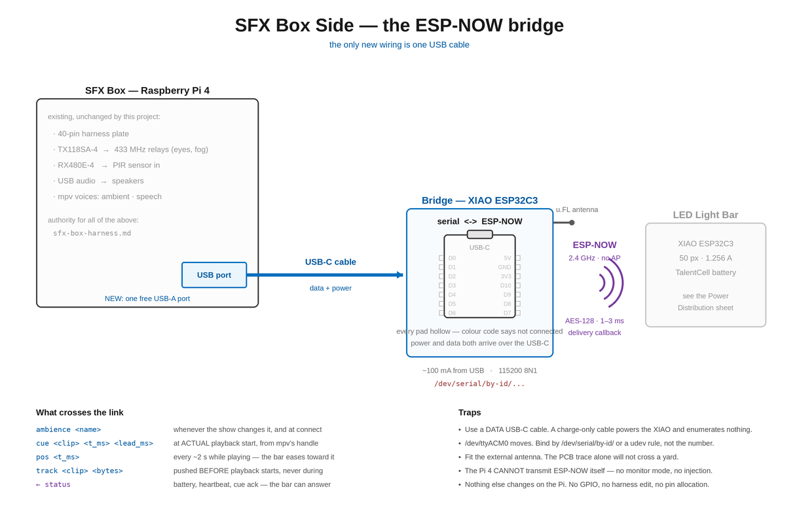

# RF Link — ESP-NOW from a Raspberry Pi 4

> **Status: CURRENT (confirmed 2026-09-09).** This was written, briefly superseded by a
> WiFi/UDP proposal, and then reinstated once the governing constraint became clear: the tiki
> runs its eyes on 433 relays and needs no network, so putting the light bar on WiFi would make
> the whole prop depend on an access point it does not currently need. ESP-NOW uses the 2.4 GHz
> radio but no access point, SSID, association, DHCP or router. See docs/02-build-and-power.md.


Date: 2026-09-04 · Supersedes the RX480E-4 section of `docs/02-build-and-power.md`

---

## The short answer

**Yes, end-to-end is possible — but the Pi 4 cannot speak ESP-NOW on its own radio.**

ESP-NOW is Espressif's proprietary protocol carried in 802.11 **vendor-specific action frames**.
To transmit one, the WiFi interface has to be in **monitor mode with packet injection**. The Pi 4's
onboard Broadcom CYW43455 does not support that under stock Raspberry Pi OS. Nexmon firmware
patches exist (Kali ships them now), but they are fragile, distro-specific, and not something to
hang a show on.

So the Pi needs a bridge. Three ways, ranked.

---

## Option A — ESP32 co-processor on the Pi's USB ★ recommended

A second **XIAO ESP32C3** plugged into the Pi 4, running ~40 lines of firmware that turns serial
lines into ESP-NOW packets and back.

```
 Raspberry Pi 4 ──USB-C──> XIAO ESP32C3 ((( ESP-NOW ))) XIAO ESP32C3 ──> LED strip
   (SFX_box)              "the radio"                    (LED box)
                     /dev/ttyACM0 @ 115200
```

**Why this wins:**

- ~$5 and about an hour of work.
- Keeps every ESP-NOW property: **no access point, no association, no DHCP**, ~1–3 ms latency,
  works the instant both ends have power, per-peer AES-128 encryption, and a **delivery callback**
  so SFX_box knows whether the box actually heard it.
- Your Python code just writes a line to a serial port. That's a smaller change to SFX_box than
  the GPIO-toggling it does for the TX118SA-4 today.
- Bidirectional for free — the box can report battery, temperature, or "I'm alive" back.
- The bridge is reusable. Every future prop joins the same mesh with no new infrastructure.

**Cost:** one more small board inside SFX_box.

---

## Option B — Skip ESP-NOW, use plain WiFi UDP with the Pi as the access point

Zero extra hardware. The Pi 4 runs as an AP (hostapd, or NetworkManager's AP mode); each box
joins as a station; cues are UDP datagrams.

**Good:** no new parts at all; arbitrary payloads; bidirectional; and everything lands on an IP
network, which fits neatly with your Prop Manager app — boxes become discoverable devices with a
web UI rather than opaque radio endpoints.

**Costs:**
- The XIAO takes a couple of seconds to associate at boot, and you must write reconnect logic
  that survives the AP rebooting. ESP-NOW has none of that.
- If the Pi also needs internet over WiFi, single-radio **AP+STA is flaky**. Use ethernet for
  internet, or add a USB WiFi dongle so one radio does each job.
- Higher idle power on both ends than ESP-NOW.

Worth choosing if you want status coming back and a browser-based control panel. Otherwise
Option A is less to go wrong on show night.

---

## Option C — ESPythoNOW plus a monitor-mode USB adapter

[ESPythoNOW](https://github.com/ChuckMash/ESPythoNOW) is a real Python library that sends,
receives and monitors ESP-NOW from Linux, supports ESP-NOW v1.0 and v2.0, and handles encrypted
messages. It requires an interface that **supports monitor mode** — so a USB adapter with
injection support (Atheros AR9271 and friends), not the Pi's internal radio. The project
describes itself as a work in progress, and only a real local hardware MAC gives you delivery
confirmation.

More moving parts than Option A, for no benefit. Reach for it only if you're allergic to adding
a microcontroller to SFX_box.

---

## Does this actually fix the problem you raised?

You wanted to stop worrying about TX and RX stepping on each other. ESP-NOW genuinely fixes it,
for reasons OOK never could:

| | 433 MHz OOK (TX118SA/RX480E) | ESP-NOW |
|---|---|---|
| Addressing | One learned pairing, 4 channels shared across the whole install | **Per-device 6-byte MAC**, unlimited devices |
| Collisions | Blind transmit into a shared channel; two transmitters talking = garbage | **CSMA** — the radio listens before it transmits |
| Confirmation | None | **Delivery callback** per packet |
| Security | Fixed code, trivially replayed | **AES-128 per peer** |
| Payload | 4 bits of "which button" | **Up to 250 bytes** — exact RGB, fade time, scene name, box ID |

---

## The one real cost: receiver power

ESP-NOW needs the radio **listening continuously**, so the XIAO can't light-sleep between cues.

| | Idle current | Over a 6 h night |
|---|---|---|
| RX480E-4 + sleeping MCU | ~25 mA | ~0.5 Wh |
| ESP-NOW, radio always on | ~80–100 mA | ~1.8 Wh |

Against a strip drawing ~2.2 W in typical use (≈13 Wh over the night), that's roughly a **10 %
runtime hit** — real, but not decisive. The 10,000 mAh power bank still covers your night with
room to spare.

*Silver lining:* it also solves the power bank auto-shutoff problem for free. A radio pulling
80 mA continuously is comfortably above the ~30–90 mA a bank needs to see to stay awake, so you
no longer need a firmware idle floor.

---

## Implementation notes

**Pin both ends to the same channel, explicitly.** ESP-NOW peers must agree. Pick one — channel
1, 6 or 11 — and set it on both sides in code rather than relying on defaults.

**Pairing:** print the XIAO's MAC over serial at boot (`WiFi.macAddress()`), then register it as
a peer on the bridge side. Keep a small table of box MACs in SFX_box's config.

**Antenna:** now the XIAO's u.FL connector and its external antenna actually matter — this is
2.4 GHz. Use the supplied antenna and get it outside any metal enclosure. (With 433 it was
irrelevant; here it's the difference between 15 m and 60 m.)

**Range reality check:** expect good coverage across a yard line-of-sight, noticeably less
through walls, and worse than 433 through dense obstructions. 2.4 GHz is also a crowded band on
Halloween night if neighbors have WiFi. If the box will be far from SFX_box or behind a wall,
test the actual placement before committing.

**Suggested payload** (fits easily in 250 bytes):

```c
typedef struct {
  uint8_t  magic;      // 0xA5
  uint8_t  boxId;
  uint8_t  cmd;        // SET / FADE / SCENE / BRIGHTNESS / OFF
  uint8_t  r, g, b, w;
  uint16_t fadeMs;
  uint8_t  sceneId;
  uint8_t  brightness;
} __attribute__((packed)) Cue;   // 12 bytes
```

**Serial bridge protocol** — keep it dead simple and human-typable so you can test with a
terminal:

```
> SEND AA:BB:CC:DD:EE:FF A5 01 02 FF 20 80 00 03E8 00 C0
< OK
< RECV AA:BB:CC:DD:EE:FF <hex>
```

**Failsafe:** on the box, if no cue arrives for N seconds, **hold the last state** rather than
blanking. A dropped packet should never kill an effect mid-scene.

---

## What happens to the RX480E-4

Keep it wired, or keep it in the drawer — your call. It costs 5 mA and five GPIOs, and it works
when nothing else does. A reasonable belt-and-braces setup is ESP-NOW for real control plus one
433 channel as a hardware "all off / panic" that works even if the ESP-NOW side has wedged.

The 5 V power architecture, the strip, the level shifter and the XIAO strapping-pin warnings in
`docs/02-build-and-power.md` are all unchanged.

---

## The SFX Box side — wiring



**There is almost nothing to wire, and that is the point of this sheet** — so nobody goes
looking for the rest of it. The bridge is a XIAO ESP32C3 in a spare USB port. No GPIO, no
harness edit, no pin allocation, nothing added to `pinmap.py`. The 40-pin plate is untouched.

### What is on the Pi already, and stays that way

The harness plate, the TX118SA-4 driving the 433 relays for the eyes and fog, the RX480E-4
reading the PIR, the USB audio adapter feeding the speakers, and mpv's two voices. **None of it
changes.** `sfx-box-harness.md` remains the authority for all of it — this sheet deliberately
does not restate any of that pinout, because a second copy of a pin table is a second copy that
can go stale.

### The bridge

| | |
|---|---|
| Board | XIAO ESP32C3 — the second of the pair |
| Connection | one USB-C cable to a free USB-A port |
| Power | ~100 mA off the USB port |
| Device | `/dev/serial/by-id/...` at 115200 8N1 |
| Antenna | u.FL external, outside the box |
| GPIO used | **none** |

### What crosses the link

```
ambience <name>               whenever the show changes it, and at connect
track <clip> <bytes>          pushed BEFORE playback starts, never during
cue <clip> <t_ms> <lead_ms>   at ACTUAL playback start, from mpv's handle
pos <t_ms>                    every ~2 s while playing — the bar eases toward it
← status                      battery, heartbeat, cue ack — the bar can answer
```

That last line is the one 433 could never give you. A one-way EV1527 channel fires and hopes;
this link reports whether the bar heard the cue, and what its battery is doing. `health.py` has
somewhere to put that.

### Four traps

- **Use a data USB-C cable.** A charge-only cable powers the XIAO perfectly and enumerates
  nothing, which presents as a working board that the Pi cannot see.
- **`/dev/ttyACM0` moves.** Add another USB serial device and the number changes. Bind by
  `/dev/serial/by-id/` or a udev rule — never the number.
- **Fit the external antenna** on the bridge as well as the bar. The PCB trace alone will not
  cross a yard, and a bridge sitting inside a box next to a Pi is in the worst RF position in
  the installation.
- **The Pi 4 cannot transmit ESP-NOW on its own radio.** No monitor mode, no injection. The
  bridge is required, not a convenience — this is the fact that shapes the whole sheet.

### Why the bridge is not a `peer`

`peers.py` addresses props over the network with a 3 s timeout and four outcomes, for triggering
*whole performances*. This link is a clock feed at 0.5 Hz with a track push in front of it. Same
box, different concern — putting it in `peers.py` would make one abstraction serve two jobs that
fail differently.

### Considered and not taken: mounting the XIAO on the 40-pin proto board

The alternative was to solder a right-angle header onto the XIAO, stand it on its side in the
harness proto board, and talk to it over a **GPIO UART** instead of USB. Decided against
2026-09-09, but the analysis is worth keeping because the mechanical instinct was sound.

**It would have worked, and the pin layout is unexpectedly convenient.** The XIAO has *two*
rows of 7 pins on 0.6" centres — not one — but everything needed sits on the row nearest the
USB-C connector:

```
5V   GND   3V3   D10   D9   D8   D7
 1    2     3     4     5    6    7
```

Four connections: **5V** (through a Schottky), **GND**, **D10** = GPIO10 as RX, **D7** = GPIO20
as TX. Solder all seven for mechanical rigidity, wire only those four.

**Use D10 and D7, never D8 or D9.** Those are two of the C3's three strapping pins. A UART line
idles high — the safe state — but a start bit arriving during the XIAO's boot instant drops it
into download mode. D10 and D7 are the only pins on that row with no strapping role.

The C3's default `Serial1` is D6/D7, and D6 is on the *other* row, so the UART needs remapping —
trivial on the GPIO matrix: `Serial1.begin(115200, SERIAL_8N1, D10, D7)`.

Both ends are 3.3 V, so the data lines connect directly with no level shifter. Cross them.

**Why USB won anyway:**

| | Header / UART | USB |
|---|---|---|
| GPIO consumed | 2 + power | **none** |
| `pinmap.py` change | allocation required | none |
| Harness edit | yes | no |
| Moving the bridge to another box | re-solder | unplug |
| Physical robustness | better — nothing to knock out | needs securing |

For a box whose stated purpose is being reconfigured season to season, **not touching the
harness is worth more than the tidiness.** The bridge stays a thing you can move between boxes
without a soldering iron.

**The one thing USB gives up is mechanical security**, and that is worth fixing deliberately:
anchor the cable and the XIAO inside the enclosure — a printed clip, a tie-down, anything that
means a knock lands on the enclosure rather than on the connector. Use a **USB-A to USB-C data
cable**, short, and dress it so it cannot be the thing that takes the strain.

**Pi-side UART notes, kept for reference** in case the header route is ever revisited: do not
use the primary UART — it is entangled with the serial console and Bluetooth. Pi 4 has four
spare (`dtoverlay=uart2` … `uart5`, BCM2711 only). Check `/boot/overlays/README` **on the Pi
itself** for which GPIOs each claims; third-party tables disagree by one position. The extra
UARTs enumerate as `ttyAMA1`, `ttyAMA2`… in probe order, not fixed by overlay, so confirm with
`dmesg | grep ttyAMA` and bind by path.
